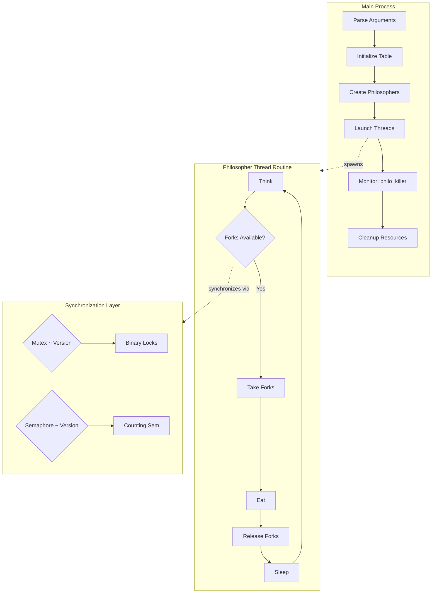

# Philosophers - Dining Philosophers Problem


Solve the classic Dining Philosophers problem through two approaches: threads with mutexes and threads with semaphores. This project demonstrates advanced synchronization techniques and race condition prevention in concurrent systems.

## Features

- **Dual Implementation**: Two separate solutions using different synchronization primitives
- **Mutex-based Version**: Classic thread synchronization with mutex locks in `philo/`
- **Semaphore-based Version**: Process synchronization using POSIX semaphores in `philo_bonus/`
- **Starvation Prevention**: Deadlock-free algorithms ensuring fair resource allocation
- **Precise Timing**: Microsecond-precision scheduling using `gettimeofday()`
- **Real-time Monitoring**: Continuous philosopher status tracking and death detection
- **Configurable Parameters**: Flexible command-line arguments for simulation tuning
- **Thread-safe Logging**: Atomic print operations preventing interleaved output
- **Memory Management**: Proper resource cleanup with zero memory leaks
- **Argument Validation**: Robust input verification with error handling

## Tech Stack

| Category | Technologies |
|----------|-------------|
| **Language** | C (C99 standard) |
| **Concurrency** | POSIX Threads (`pthread.h`), Mutexes (`pthread_mutex_t`), Semaphores (`semaphore.h`) |
| **Build System** | Make, GCC with strict flags `-Wall -Wextra -Werror` |
| **Debug Tools** | ThreadSanitizer compatible (`-fsanitize=thread`), Valgrind Helgrind |
| **Timing** | POSIX `gettimeofday()` for microsecond precision |

## Technical Decisions & Architecture

This implementation tackles the **Dining Philosophers Problem**, a classic synchronization challenge that exposes fundamental issues in concurrent programming: race conditions, deadlocks, and resource starvation. The architecture separates concerns into two distinct implementations because each approach offers different trade-offs:

**Mutex Version** (`philo/`): Uses binary mutex locks to represent forks. Each philosopher holds references to adjacent mutexes, preventing simultaneous access to shared resources. The key innovation is the **ordering strategy** - philosophers pick up forks in address order (lower address first), which prevents circular wait conditions and eliminates deadlock potential.

**Semaphore Version** (`philo_bonus/`): Replaces individual mutexes with a counting semaphore representing available forks. This abstraction simplifies the model - the semaphore naturally limits concurrent fork access to N-1 philosophers, guaranteeing at least one philosopher can always eat. Named semaphores enable inter-process synchronization.

Both implementations share a **monitoring thread pattern**: the main thread continuously checks philosopher states while worker threads execute dining cycles independently. This separation allows precise death detection without blocking the dining simulation. The `sleep_precise()` function uses busy-waiting with `usleep(200µs)` intervals to achieve microsecond accuracy without consuming excessive CPU cycles - a necessary compromise given that standard `usleep()` lacks precision for short intervals.



## Getting Started

Clone and build in under 1 minute:

```bash
# Clone the repository
git clone https://github.com/samuelhm/Philosophers.git
cd Philosophers

# Build mutex version
cd philo && make

# Or build semaphore version
cd ../philo_bonus && make
```

Run simulations with custom parameters:

```bash
# Syntax: ./philo <philosophers> <time_to_die> <time_to_eat> <time_to_sleep> [meals_required]

# Example: 5 philosophers, 800ms death timer, 200ms to eat/sleep
./philo 5 800 200 200

# Example with meal limit: must eat 7 times each
./philo 5 800 200 200 7

# Stress test: 2 philosophers, aggressive timing
./philo 2 400 200 200
```

Parameter description:
- `philosophers`: Number of philosophers at the table (N ≥ 1)
- `time_to_die`: Milliseconds before death if no eating occurs
- `time_to_eat`: Milliseconds to complete a meal
- `time_to_sleep`: Milliseconds spent sleeping after eating
- `meals_required` (optional): Stop after each philosopher eats N times

## Project Structure

```
Philosophers/
├── philo/                 # Mutex-based implementation
│   ├── inc/philo.h        # Structures and function prototypes
│   ├── src/
│   │   ├── philo.c        # Main entry and thread spawning
│   │   ├── actions.c      # Eat, sleep, think operations
│   │   ├── checks.c       # Input validation and initialization
│   │   ├── philo_utils.c  # Utility functions
│   │   └── time_utils.c   # Precise timing functions
│   └── Makefile
├── philo_bonus/           # Semaphore-based implementation
│   ├── inc/philo.h        # Semaphore-specific structures
│   ├── src/               # Mirror of philo/ with semaphores
│   └── Makefile
└── README.md
```

## Testing & Debugging

```bash
# Compile with thread sanitizer for race detection
make clean && make CFLAGS="-Wall -Wextra -Werror -g -O1 -fsanitize=thread"

# Run with Valgrind's Helgrind tool for deadlock detection
valgrind --tool=helgrind ./philo 5 800 200 200

# Quick validation - should not die
./philo 1 800 200 200     # Single philosopher edge case

# Death scenario - one philosopher will die
./philo 4 310 200 100
```

## Contact

Samuel H. M.

[](https://github.com/samuelhm/)
[](https://www.linkedin.com/in/shurtado-m/)